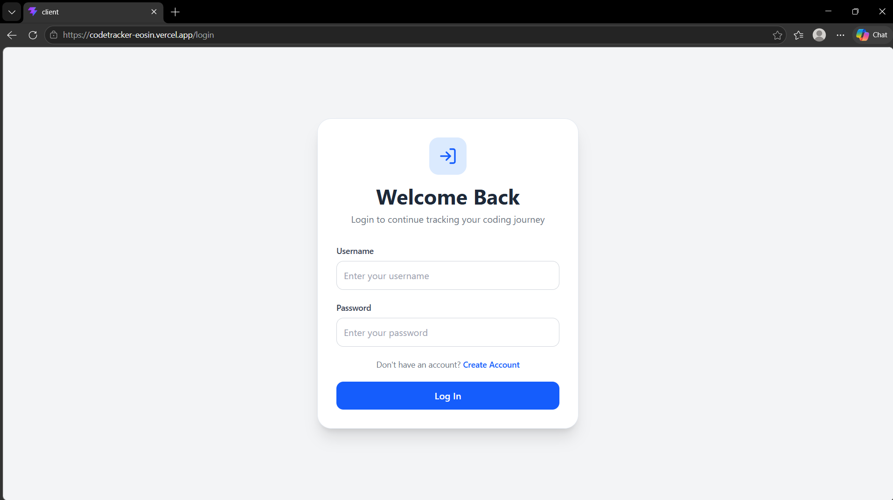
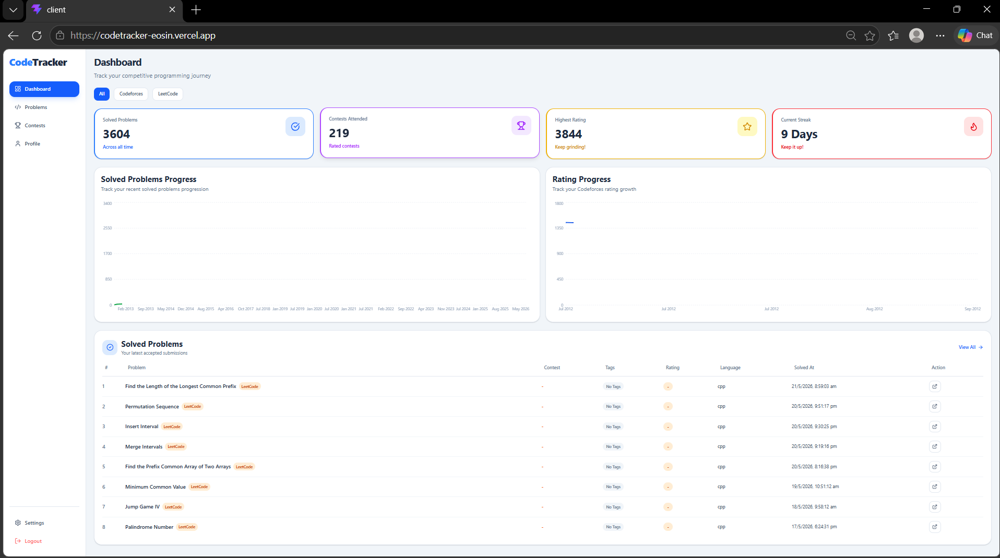
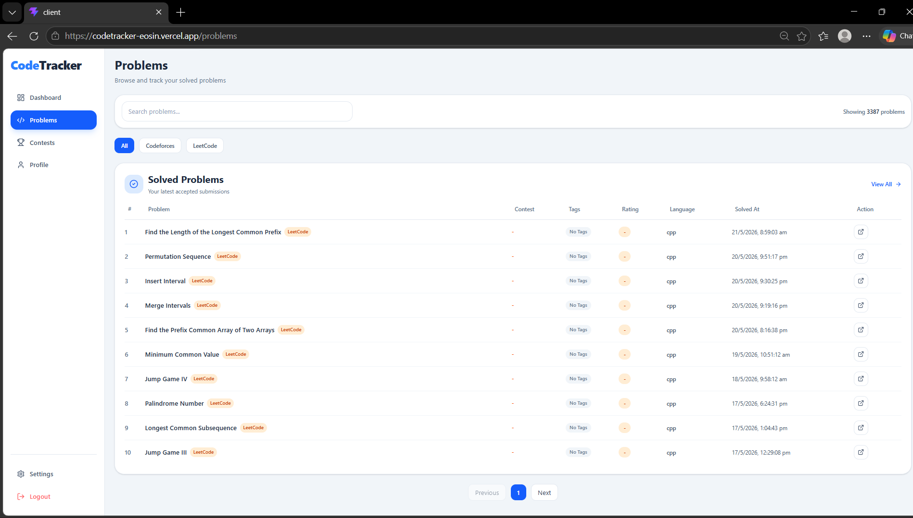
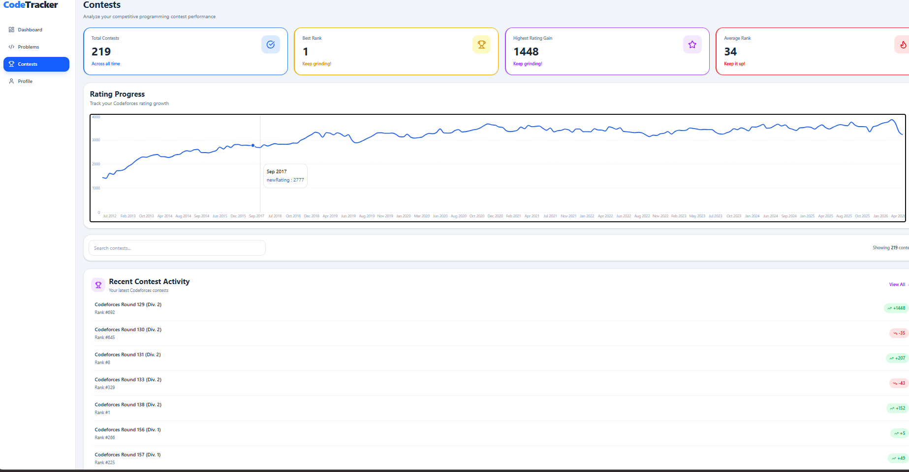

# CodeTracker

CodeTracker is a full-stack competitive programming tracker that helps users monitor their coding progress, analyze problem-solving patterns, and visualize performance across platforms like Codeforces and LeetCode.

## 🚀 Live Demo

- Frontend: https://codetracker-eosin.vercel.app
- Backend API: https://code-tracker-api-09bu.onrender.com

---

## ✨ Features

- 🔐 User Authentication & Authorization
- 🛡️ JWT Protected Routes
- 👤 Connect Codeforces Profile
- 📊 Dashboard Analytics
- 📈 Topic Distribution Charts
- 🧠 Problem Solving Statistics
- 🏆 Contest Activity Tracking
- ✅ Recent Solved Problems Section
- 🌙 Dark Mode Support
- 📱 Fully Responsive UI
- ⚡ Fast and Modern Interface

---

## 🛠️ Tech Stack

### Frontend
- React
- Vite
- Tailwind CSS
- Axios
- React Router DOM
- Recharts
- React Icons

### Backend
- Node.js
- Express.js
- MongoDB Atlas
- Mongoose
- JWT Authentication
- bcryptjs
- CORS

---

## 📂 Folder Structure

```txt
CodeTracker/
│
├── client/        # Frontend
├── server/        # Backend
│
├── README.md
```

---

## ⚙️ Environment Variables

### Frontend (`client/.env`)

```env
VITE_API_URL=https://code-tracker-api-09bu.onrender.com
```

### Backend (`server/.env`)

```env
PORT=3000
MONGO_URI=your_mongodb_connection_string
JWT_SECRET=your_secret_key
CLIENT_URL=https://codetracker-eosin.vercel.app
```

---

## 📦 Installation & Setup

### 1️⃣ Clone the Repository

```bash
git clone https://github.com/pradeepkambalapally/codetracker
cd CodeTracker
```

### 2️⃣ Setup Frontend

```bash
cd client
npm install
npm run dev
```

### 3️⃣ Setup Backend

```bash
cd server
npm install
npm start
```

---

### Demo Credentials

Username : demo
Password : demo321


## 🌐 Deployment

- Frontend deployed on Vercel
- Backend deployed on Render
- Database hosted on MongoDB Atlas

---

## 📸 Screenshots

### Login Page



### Dashboard



### Problems



### Contests



---

## 🔮 Future Improvements

- Add CodeChef API Integration
- Contest Reminder System
- Problem Difficulty Analytics


---

## 🤝 Contributing

Contributions are welcome!  
Feel free to fork the repository and submit a pull request.


---

## 👨‍💻 Author

Developed by Pradeep Kambalapally.